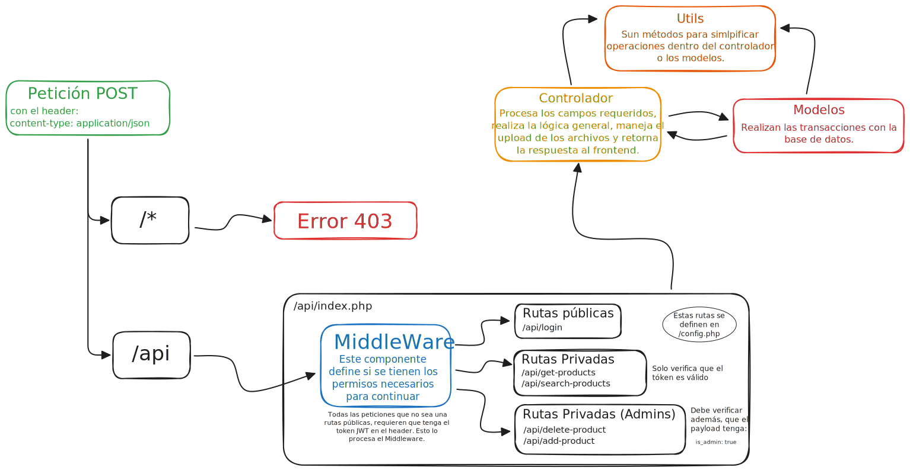

<div align="center">


<br>


</div>

Proyecto realizado para el curso que brinda ***Talento Tech*** a traves de la *Agencia de Habilidades para el Futuro* del *Ministerio de Educación* de la ciudad.

[](/docs/develop.md)
[](/docs/react.md)
[](/docs/docker.md)

<h2>🚀 Consignas Finales</h2>

- [x] Form para agregar **productos**
- [ ] Edición de productos
- [x] Eliminación de productos
- [x] Manejo de errores provenientes de la API
- [x] Diseño responsivo con Bootstrap
- [x] Interactividad mejorada con React Icons y React Toastify (**se utilizó SweetAlert2**)
- [x] SEO y accesibilidad con React Helmet
- [x] Barra de búsqueda para filtrar productos
- [x] Paginador de productos
- [x] Documentación básica del proyecto

<br />
<br />

---

# Estructura del Proyecto
## Backend
Para el backend se utiliza un servidor personal con el servicio de PHP, configurado para atender sobre un dominio y puerto privado. La idea es utilizar la siguiente estructura haciendo uso del paquete [Firebase/PHP-Jwt](https://github.com/firebase/php-jwt) para manejar las sesiones de usuarios.

<div align="center">

</div>

Cuando el usuario inicia sesión, se crea un token con la siguiente estructura:
```php
[
    "iat" => time(), 
    "exp" => time() + JWT_EXPIRATION_TIME, 
    "username" => $username, 
    "is_admin" => $db["data"]["is_admin"]
];
```
Esto permite mantener en el payload (vigente durante `JWT_EXPIRATION_TIME` segundos), el usuario y el rol del mismo (admin o user).

El frontend debe guardarlo en el contexto para luego reutilizarlo en cada peticion que realize al backend. De esta forma se garantiza que el usuario utiliza una sesión válida.

> [!TIP]
> No se implementó la renovación del token ante la caducidad del mismo dado que es una version demostrativa. El backend debería al detectar la caducidad del token generar uno nuevo contrastando los datos con la base de datos.

 
 <br><br>

 ## Frontend
 El frontend se sirve con GitHub Pages y se configura para utilizar la url de la api desarrollada. Se utiliza un sistema de **Hooks** y **Servicios** para facilitar la forma en que se realiza la petición al backend.

 Especificamente en el manejo de los productos, se utilizan hooks para hacer uso de los servicios listados en [`apiProductos.js`](frontend/src/services/apiProductos.js). A si mismo, estos servicios utilizan una funcion definida en [`src/utils/checkResponse.js`](frontend/src/utils/checkResponse.js) que permite interpretar la respuesta del backend dado que la misma siempre tiene la misma estructura.

 La lógica es la siguiente:
 - El hook es llamado y lanza el servicio
 - El servicio realiza el fetch utilizando **Axios**
 - Se valida la respuesta (con `checkResponse.js`) verificando que se recibieron todos los campos.
 - Si todo es correcto, se retorna la respuesta al hook
 - El hook evalua si la sesión caducó, o si la respuesta no contiene los datos que pidió, o cualquier otro error en la solicitud. En caso de no haber errores, retorna los valores especificos de cada hook.