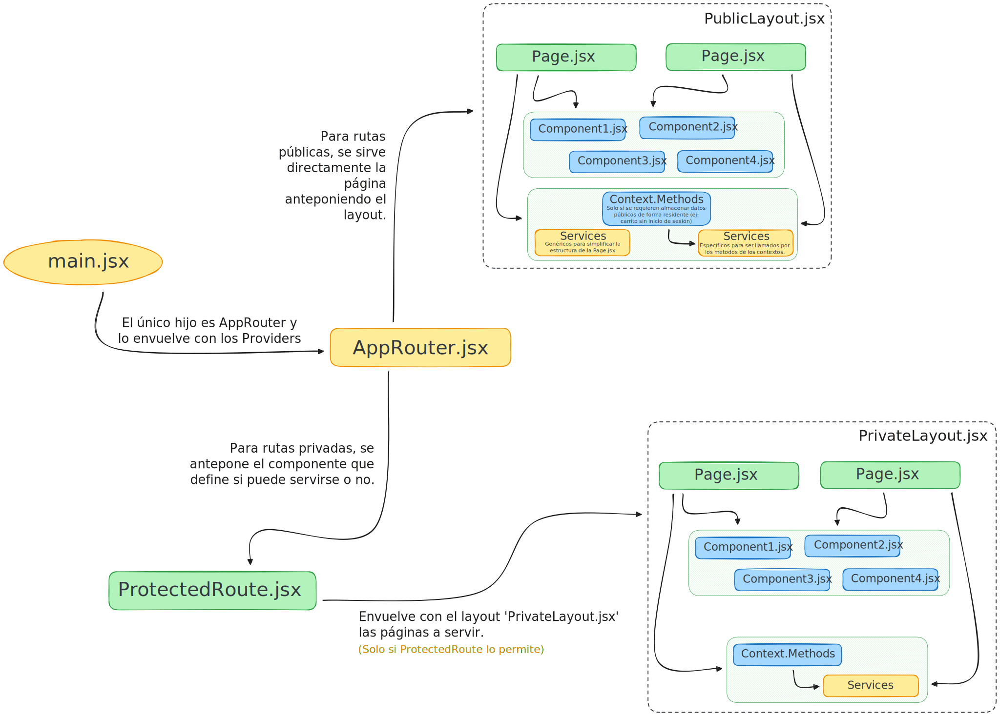

[](https://github.com/christian-herrera/curso-react)

<h1>Notas</h1>
<h2>Tabla de contenidos</h2>

- [Variables en Javascript](#variables-en-javascript)
  - [Objetos](#objetos)
  - [Arrays](#arrays)
  - [Funciones para Arrays](#funciones-para-arrays)
    - [ForEach()](#foreach)
    - [Map()](#map)
    - [Find()](#find)
    - [Reduce()](#reduce)
- [Estructura y responsabilidades de archivos](#estructura-y-responsabilidades-de-archivos)

<br><br>

# Variables en Javascript

## Objetos

Se definen de la siguiente forma:

```js
const producto = {
    id: 1,
    nombre: "Manzana",
    precio: 100,
    detalles: {
        color: "Rojo",
        peso: 0.2,
    },
};
```

Luego, para acceder o modifiarlos, se hace uso del `.` (punto). Para un acceso de forma segura a una propiedad que puede que no exista, en lugar del punto se usa `?.`:

```js
console.log(producto.nombre); // Manzana
console.log(producto.detalle.color); // Rojo
console.log(producto["precio"]); // 100

console.log(producto.detalles?.color); // Rojo (si existe, devuelve el valor normalmente)
console.log(producto.detalles?.sabor); // undefined
console.log(producto?.oferta.precio); // udnefined
```

Los dos ultimos ejemplos, no lanzan un error dado que se usa el `?.`.

<br><br>

## Arrays

Los arrays son una lista ordenada de elementos. Se definen de la siguiente forma:

```js
const productos = [
    { id: 1, nombre: "Manzana", precio: 100 },
    { id: 2, nombre: "Pera", precio: 150 },
    { id: 3, nombre: "Frutilla", precio: 200 },
];
```

Dado que es una lista ordenada, se acceden con un indice usando los corchetes:

```js
console.log(productos[0].nombre); // Manzana
console.log(productos[2].precio); // 200
```

<br><br>

## Funciones para Arrays

### ForEach()

Permite recorrer todos los elementos de un array y ejecutar una función por cada uno de ellos:

```js
productos.forEach((p) => console.log(p.nombre));
```

<br><br>

### Map()

Permite recorrer **_todos_** los elementos de un array y realizar por cada uno de ellos una operación. Retorna siempre el mismo array pero con las modificaciones hechas en cada item.

La sintaxis básica es:

```js
const numeros = [1, 2, 3, 4];

const cuadrados = numeros.map((num) => num * num);

console.log(numeros); // [1, 2, 3, 4]  -> el array original no se modificó
console.log(cuadrados); // [1, 4, 9, 16]
```

<br><br>

### Find()

Es un método de los arrays en JavaScript que permite buscar un elemento que cumpla cierta condición.

Devuelve:

-   El primer elemento que cumpla la condición.
-   Si no existe coincidencia, devuelve `undefined`.

La sintaxis básica es:

```js
const productos = [
    { id: 1, nombre: "USB", precio: 50 },
    { id: 2, nombre: "Mouse", precio: 200 },
];

const existe1 = productos.find((p) => p.id === 2); // La busqueda es que el item, tenga `id` = 2
const existe2 = productos.find((p) => p.id === 5); // La busqueda es que el item, tenga `id` = 5

console.log(existe1); // => { id: 2, nombre: "Mouse", precio: 200 }
console.log(existe2); // => undefined
```

<br><br>

### Reduce()

Permite recorrer todos los items de un objeto para realizar una operacion con cada uno de ellos y devolver un **_único valor_**.

La sintaxis básica es:

```js
const productos = [
  { id: 1, nombre: "USB", precio: 50 },
  { id: 2, nombre: "Mouse", precio: 100 }
  { id: 3, nombre: "Teclado", precio: 150 }
  { id: 4, nombre: "Parlante", precio: 200 }
];

// Lleva dos parámetros:
// - `acum` es la variable de salida, en este caso, acumulación
// - `item` corresponde al objeto del array. Cada uno de los {...}
const suma = productos.reduce( (acum, item) => acum += item.precio, 0);

console.log(suma) // 500
```

<br><br><br>

# Estructura y responsabilidades de archivos

En el proyecto se adopta cierto grado de responsabilidad por cada archivo. Una primer estructura es la siguiente:

<div align="center">

</div>
De forma resumida, se tiene lo siguiente:<br><br>

> [!IMPORTANT]
> Los **layouts**, **páginas** y **componentes** tienen libertad de usar los `Context` si necesitan algun valor de ellos.

> [!IMPORTANT]
> Una **Página** debe atender solo la UI y los eventos del usuario, pero no debe manejar la logia interna del evento allí mismo.
> Estos eventos deben llamar a un método de un _contexto_ para que este contexto llame a un _servicio_ (si lo requiere).

<br><br>

Finalmente, la tabla de responsabilidades que se intenta seguir será:

|     Archivo      | Responsabilidades                                                                                                                                                                                             | No deberia...                                                                                                |
| :--------------: | ------------------------------------------------------------------------------------------------------------------------------------------------------------------------------------------------------------- | ------------------------------------------------------------------------------------------------------------ |
|    `main.jsx`    | **Es el punto de entrada de la app**. Monta React en el DOM y envuelve al `AppRouter` con todos los providers globales.                                                                                       | Tener lógica de negocio ni rutas.                                                                            |
| `AppRouter.jsx`  | **Definir y organizar las rutas principales**. Aplica layouts (público, privado, etc) y define que rutas están protegidas mediante `UserRoute` y `AdminRoute`.                                                | Hacer manejo de sesión ni peticiones al backend.                                                             |
| `UserRoute.jsx`  | **Proteger rutas privadas (No Admins)**. Verifica si el usuario está autenticado (por ejemplo: leyendo del contexto). Y redirige o renderiza segun la sesión.                                                 | Realizar el `fetch()` al backend ni modificar el estado global.                                              |
| `AdminRoute.jsx` | **Proteger rutas privadas (Admins)**. Verifica únicamente si la sesion corresponde a un _admin_. La comprobación de la propia sesion la hace `UserRoute`.                                                     | Realizar el `fetch()` al backend ni modificar el estado global.                                              |
| **Contextos...** | **Manejan el estado global y lo exponen a toda la app**. Internamente usarán servicios para comunicarse con el backend.                                                                                       | No hacen `fetch()` directamente. Tampoco renderizan componentes ni definen rutas.                            |
|  **Páginas...**  | **Serán vistas completas de la app**. Representan pantallas (Login, Dashboard, etc). Pueden usar _componentes_ y _contextos_. pueden invocar servicios (cosas puntuales) o llamar a métodos de los contextos. | Guardar estado global, definir rutas o layouts. Tampoco manejan lógica global ni almacenamiento persistente. |
| **Contextos...** | **Serán las piezas reutilizables de UI**. No dependen de una página especifica, reciben props, no usan contextos globales salvo que sea estrictamente necesario (por ejemplo: temas).                         | Conocer reglas de negocio ni hacer peticiones al backend directamente.                                       |
| **Servicios...** | **Manejan la comunicación con el backend**. Contienen funciones puras para realizar `fetch()` o `axios()` a la API.                                                                                           | acceder directamente a hooks, contextos o variables de estado.                                               |
